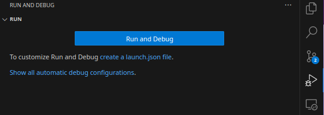
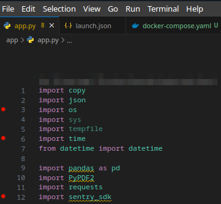

# Debugging python inside of a docker container
### Premises
 Lets say you are working on some legacy python project which has very obscure and obsolete dependencies and you now want to debug it.
 First lets pray to god that, this day does not come to anybody but if you are working on some project without standard practices on package management, this kind of situation is not uncommon.
## The Problem
 Making a local dev envs.
- Even though pyenv and poetry to name a few is able to install different versions of python along with old deps, what if the packages are so old even pip does not have them.
	- A few old python packages do delete old version from pipy instead of yanking them that will cause the old programs to even stop running in the near future.
- The next problem is bloat if you have multiple of these shitty projects then you would not want your whole system to endure the cost of multiple old and obsolete python versions in the long run. Lets admit it nobody remembers to uninstall the things that we installed just to make things to working, instead we leave it in our system till we get out of space or some other things break due to that. The latter case will be the most troublesome because it might take another full day just to know the reason why your new program is not working and that the problem was you having an old version of something else.
## The solution
 My solution to this problem is to debug inside of a container.
 You replicate the environment that your system was running on, inside of a container.
- This is a breeze if you already had your program containerized.
	- Get the container that has been running this whole time in production. Either docker pull or form sysadmin.
	- Here is one of the answer on how to load the image to your local docker instance if you don't have access to docker pull image:
	- https://stackoverflow.com/questions/37905763/how-do-i-download-docker-images-without-using-the-pull-command

- But if you had not done so before, you need answers to following things from your sysadmin or anyone who has access to the running system:
	- What is the OS? if Its Windows, Goodluck on that. Go the usual pyenv/poetry route.
	- The output of pip freeze and python version. Get hands on requirements.txt.
- Now containerize your application.
	- Make a simple docker image having following steps:
	- ```Dockerfile
	  ## The name and versions should be the one from your production system.
	  ## It should be available in dockerhub as they normally have older images too.
	  FROM debian:<tag>
	  
	  ## Install the required libraries. apt is for debian.
	  RUN apt update && apt install .....
	  
	  ## Install debugpy to initialize remote debugging session.
	  RUN pip install debugpy
	  
	  COPY ./requirements.txt /requirements.txt
	  RUN pip install -r requirements.txt
	  
	  ## Some other pip installs you have some custom python packages to install.
	  
	  ## This so that you can get shell access to the docker without doing docker exec anything
	  CMD ["bash"]
	  ```
- If you have a bit of complex program requirements like requiring redis or some other things then you can use a `docker-compose.yaml` file. This was the case in my case. Feel free to take reference from dockercompose below:
  ```yaml
  services:
    dev-container:
    	## I have this because I have access to do docker pull.
      ## If you have to build from dockerfile, you can give this any name,
      ## then uncomment the build part below
      image: us-docker.pkg.dev/<project_id>/us.gcr.io/<image_name>:<image_tag>
      # build:
      #   context: .
      #   dockerfile: Dockerfile
      #   args:
      #     - GITLAB_DEPLOY_TOKEN=<GITLAB_TOKEN>
      ## I needed this because I had custom old package to install from gitlab's package registry.
      
  
      volumes:
        - ./app:/app
        - ./service_account.json:/srv/key.json ## this was required to access google specific resource inside the program
      env_file:
        - ".env"
      environment:
        - GOOGLE_APPLICATION_CREDENTIAL_PATH=/srv/key.json
        - FLASK_APP=app.app:app
        
      ## uncomment this instead of network_mode : host if you have the ports inside the container occupied.
      # ports:
      #   - 8080:8080
      network_mode: "host"
      stdin_open: true
      tty: true
      command: ["bash"]
  
    ## my program required redis too.
    redis-master:
      image: redis:latest
      # ports:
      #   - "6379:6379"
      command: redis-server --appendonly yes --requirepass 123456789
      network_mode: "host"
      env_file:
        - ".env"
  
  ```
 ### Debugpy to rescue
- Debugpy a implementation of a **[Debug Adapter Protocol](https://microsoft.github.io/debug-adapter-protocol/)** for python which is protocol developed my microsoft that defines abstract rules of communication between  a IDE or text editor and the debugger. (PDB in our instance)
- Its a remote debugging application developed by microsoft and used in vscode for debugging.
- We then do `docker run --name dev-container --env-file .env --network host -it -v <local_source_code_path>:<path_inside_container>  <image_name>`
- Now that your docker container is running, you can attach your current shell to the container:
  ` docker attach <container_name>`
	- container name is the name you gave while doing docker run. If you had skipped that part, docker will give you a random name. To get that name, you do `docker ps` to show currently running container and get the random name from that.
- #### Running debugpy inside the container
- Once you got inside of the shell of the running container, you run the program.
  `python -m debugpy --listen 0.0.0.0:5678 -m flask run --host='0.0.0.0' --port=8080`
- This is for flask application but if you are running something else modify it accordingly.
  For more information on debugpy and its options view its [github page](https://github.com/microsoft/debugpy).
- #### Connecting your vscode instance with the debugpy running inside of the container
- Open vscode in the dir you mounted or the project dir.
- Make a new launch.json or make vscode make it automaticaly for you.
  
	- Click on `Create a launch.json file > Python Debugger > Remote Attach`.
	- Leave the hostname on `localhost` and port to 5678 because we set it while launching debugpy in previous step.
		- We are keeping hostname to localhost and port to 5678 because we have `--network host` while running docker container. If 5678 is somehow occupied in your system then forward the port 5678 to some other available port like 9874 in your system by using `-p <local_port>:<container_port>` while doing docker run.
	- Now you will get something like this in your `launch.json`
	  ```json
	  {
	      // Use IntelliSense to learn about possible attributes.
	      // Hover to view descriptions of existing attributes.
	      // For more information, visit: https://go.microsoft.com/fwlink/?linkid=830387
	      "version": "0.2.0",
	      "configurations": [
	          {
	              "name": "Python Debugger: Remote Attach",
	              "type": "debugpy",
	              "request": "attach",
	              "connect": {
	                  "host": "localhost",
	                  "port": 5678
	              },
	              "pathMappings": [
	                  {
	                      "localRoot": "${workspaceFolder}",
	                      "remoteRoot": "."
	                  }
	              ]
	          }
	      ]
	  }
	  ```
	- Fix the Path mappings with the paths you had while doing docker run in -v part. I had `-v ./app:/app` so I will change the `pathMapping` to something like:
	  ```json
              {
                  "pathMappings": [
                      {
                          "localRoot": "${workspaceFolder}",
                          "remoteRoot": "."
                      }
                  ]
              }
	  ```
- Now while the container and the program you want to debug inside is running with debugpy, you set breakpoints like you normally used to do clicking beside the line numbers.
    
- Press F5 to launch the debugging session and try to run the program normally. You can send the request to the server if its http server or something like that.
- Once the code execution hits breakpoint, your program will pause automatically at the breakpoint and you can inspect variables, invoke functions and others.