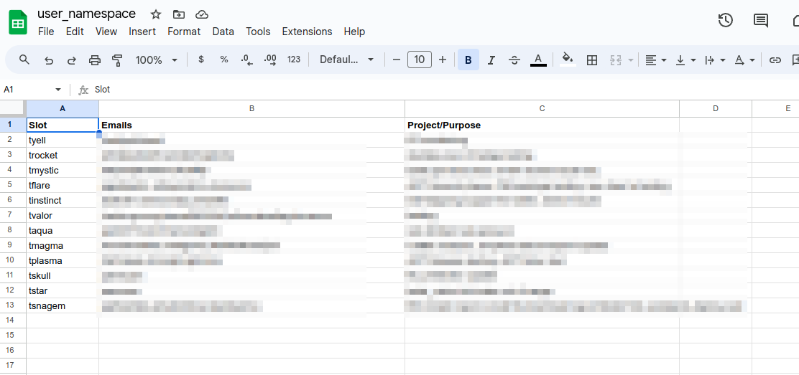

## How we made debugging on cloud easier without costing a fortune.
- ### Preface
- Any organization will require good and flexible environment for every developer to test their code before merging it to the main branch.
- This is normally not required for small-medium monolith application but if the application is too big or consists of a lot microservices and we want to test integration between mutliple microservices. This does not occur often but occurs when you have a feature to implement that will span changes across a lot of microservices. There are other method to test these like writing unit tests for each api of microservice so that it adhers to certain schema and changing the schema as per the changes done and the expected value.
- But before any release the end to end test will anyhow be necessary.
- ### The Problem
	- All the pushes makes their code live on single shared environment (Testing Env) clashing feature specific tests.
	- If someone pushes faulty code, making a microservice halt, all the other ongoing test will be affected. This will be a major setback if there is some feature that requires quite a bit of time to test one feature.
	- Resulting in **Increased time for almost every feature release.** Which sometime meant lost first mover advantage.
- ### The Solution
	- #### Separate resource for each developer or shared resources among a team
		- This method will work but will be expensive as there will be constant resource consumption if any team forgets to release their resources, unless we think about premption of unused resources which will be difficult to implement or require cloud platform specific implementation or some terraform script to do so.
		- This will also allow team to use the resource allocated to them for something else then work. Its okay if you have enough resources as developers also need some breathing room to test new stuffs but will be difficult to maintain if you already have thousands of dollars of bill from your cloud provider every week.
	- #### Automatic Creation of required resources and their premption on inactivity the k8s way.
		- This method was most suitable in our case as separating the resources for different teams to test means less traffic on existing shared Testing Env. This made such that we can decrease the resource footprint of the existing shared env.
		- We settled in the conclusion of creating 12 static namespaces that will house our entire product's deployment. And making a mapping sheet to map teams to those namespaces.
		- Our company has unfettered mania of naming things after things in pokemon so we decided to go with the same flow to name our namespaces and environment by pokemon teams, 12 of them.
		- **Setup Minimal permission**
			- Make it such that people have view access to the 12 namespaces defined so they can realtime stream container logs or look at the exact config of the deployment or pod.
		- **Mapping people to namespaces**
			- We wanted to make this part as effortless as possible for the developers along with decreasing our effort of managing the pipeline configuration. So we settled with Google Sheet.
			- We made a sheet with 3 colums: Slot, Usernames, Purpose. The first had list of 12 namespaces we created, second would house github usernames of guys currently claiming that space separated by comma, and the last would be some sort of remarks to indicate why was the slot occupied by that person.
      
		- **The Workflow**
			- Someone pushes code to our backend repos.
			- Github workflow is triggred.
				- We used google's gspread client and inlined python script to access the content of the namespace sheet.
				- Installs the backend helm package to the namespace found from the sheet.
      - Below is the actual step in github workflows that we used to interface gsheet with github workflow:
      ```yaml
        shell: bash
        run: |-
          pip3 install gspread==5.12 oauth2client
          SLOT_INFO=$(python3 -c "
          import gspread;
          from oauth2client.service_account import ServiceAccountCredentials;

          scope = [
            'https://www.googleapis.com/auth/spreadsheets', 
            'https://www.googleapis.com/auth/drive.file', 
            'https://www.googleapis.com/auth/drive' 
          ];
          
          creds = ServiceAccountCredentials.from_json_keyfile_name('$GOOGLE_APPLICATION_CREDENTIALS', scope);
          
          client = gspread.authorize(creds);
          datas = client.open('$SHEET_NAME').sheet1.get_all_records();
          
          print(f'slot mapping data: {datas}');
          slot_of_interest = [val for val in datas if '$TRIGGER_EMAIL' in list(map(lambda e: e.strip(), val['Emails'].split(','))) and '$TRIGGER_EMAIL' ];
          
          [print(f'''{data['Slot']}::{data['Emails']}''')for data in slot_of_interest ];
          " )
          echo $SLOT_INFO
          
          SLOT_INFO=$(echo "$SLOT_INFO" | grep -m 1 -E '::' ) || :
            
          if [[ "$SLOT_INFO" == "" ]]; then
            echo "User not allocated on any namepace. Please update the sheet at https://tinyurl.com/docsumo-namespace with your username ($TRIGGER_EMAIL)."
            exit 1
          fi
    
          echo "found slot details of current user. $SLOT_INFO"
          KUBE_NAMESPACE=$(echo $SLOT_INFO | awk -F"::" '{print $1}' )
          IFS=$',' read -ra EMAILS <<< $(echo $SLOT_INFO | awk -F"::" '{print $2}' )
          HOST=${KUBE_NAMESPACE}.docsumo.com
          echo "HOST=$HOST" >> $GITHUB_ENV
          echo "KUBE_NAMESPACE=$KUBE_NAMESPACE" >> $GITHUB_ENV
          
          echo "final env values; HOST; $HOST, emails; ${EMAILS[@]}, KUBE_NAMESPACE; $KUBE_NAMESPACE"
      ```
		- Each namespace will have a cronjob monitoring controller logs and if no request is coming for the last 1 hour, we delete all the resource consuming resources in that namespace, That will include all the deployments and statefulsets.
    
    - **The Premption**
      - The premption of resource was handled by a cronjob installed in each namespace that ingested gcloud ingress logs to see if someone was using the namespace.
      - If there is no request logs in the last 1 hour, we delete all the resources of that namespace by doing helm uninstall on all the installed charts.
      - Below is the exact cronjob that we used for this purpose.
      ```yaml
        apiVersion: batch/v1
        kind: CronJob
        metadata:
          name: delete-on-inactivity
          namespace: {{ .Release.Namespace }}
        spec:
          schedule: "0 * * * *"
          jobTemplate:
            spec:
              template:
                spec:
                  serviceAccount: pod-manager
                  containers:
                  - name: log-checker
                    image: {{ .Values.cronjobimage.repository }}:{{ .Values.cronjobimage.tag }}
                    args:
                    - /bin/bash
                    - -c
                    - |
                      RELEASES=$(helm ls --short -n {{ .Release.Namespace }} | grep -vE 'roles')
                      if [[ ! "$RELEASES" ]]; then echo "Nothing found that can be deleted, exiting."; exit 0; fi
                      echo $LOG_READER_CREDS | base64 -d > log_reader.json
                      gcloud auth activate-service-account --key-file=log_reader.json
                      gcloud config set project {{ .Values.project_id }}
                      OFFICE_TIME=(3 14)
                      if [[ $(date -u +%-H) -le ${OFFICE_TIME[1]} && $(date -u +%-H) -ge ${OFFICE_TIME[0]} ]]; then
                        echo "Its office time.."
                        TIME_PERIOD=`date -u -d'2 hour ago' +%Y-%m-%dT%TZ`
                      else
                        TIME_PERIOD=`date -u -d'1 hour ago' +%Y-%m-%dT%TZ`
                      fi
                      gcloud logging read "timestamp >= \"${TIME_PERIOD}\" AND resource.type=\"k8s_container\" AND resource.labels.cluster_name=\"testing-cluster\" AND resource.labels.container_name=\"controller\" AND resource.labels.namespace_name=\"ingress-nginx\" AND jsonPayload.proxyUpstreamName~=\"{{ .Release.Namespace }}\"" --limit 10 --format=json > output.json
                      count=$(jq '. | length' output.json);
                      if [[ $count -eq 0 ]];
                      then
                        echo "no Logs found in namespace '{{ .Release.Namespace }}' for last one hour, deleting all the resources."
                        helm ls --short -n {{ .Release.Namespace }} | grep -vE 'roles|config' | xargs -I {} helm uninstall {} -n {{ .Release.Namespace }} --debug
                      else
                        echo "logs found on last one hour, not deleting the releases"
                      fi
                    env:
                      - name: LOG_READER_CREDS
                        valueFrom:
                          secretKeyRef:
                            name: google-app-credential-logging
                            key: GOOGLE_APPLICATION_CREDENTIALS_LOGGING

                  restartPolicy: OnFailure
      ```

		- **Blockers faced in the way**
			- We are using external secret operator to sync our backend secrets with GCP's secret manager which when deleted in bulk was failing saying it failed to call some internal webhook. Probably overloading the internal webhook deployment of the operator.
			- We then decided to not delete configmaps and secrets from namespaces as they anyways would not take much resources.

- ### Possible enhancements
- The next thing we can do is debug totally in cloud. I have another article written about how we can actually remote debug our python code in vscode. [Here](/post/debugpy/)
- We setup each deployment to run debugpy instead of normal gunicorn and with a little bit of firewall setup and ip whitelisting, we can actually connect to remote debugger. **This allows for debugging in the actual hardware that the production server runs on which helps debug cloud specific issues in some instances**
  
- ### Conclusion
- First shield of defence: make each and every microservice autonomous so the need of integration tests are rare. But if your domain does not allow you to do that then this way of making separate test environment would be cheap and effective in the long term of your startup journey. In the end, each developer having access to a vm or multiple vagrant instances would come into picture but when the money and resources are limited, this approach is also not bad.