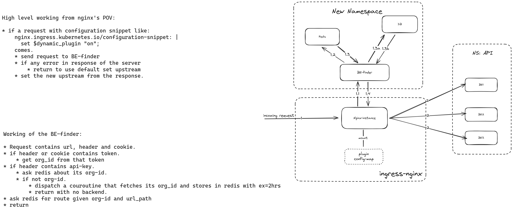

# Problem
- Consider your product is going through a big overhaul and re-architecturing where the existing microservices might be broken into multiple ones or merged to single ones, there will be a big jumble of mess of routes at the ingress level.
- This will make transitioning a bit hard as using canary based routing will gradually become complicated. So to simplify this canary setup, we take the routing matter into our own hands.
- If you can use Consul and it works right for you, that might be the better option as Consul is more mature and production ready. You will be less likely to break things.

# The Solution
- Architecture proposed:


# Implementation
- Its Almost same as auth implementation but will require a bit of scripting as we are not just checking status code to return 401 or to allow the traffic.
- This can be easily achieved with [configuration snippet](https://kubernetes.github.io/ingress-nginx/user-guide/nginx-configuration/annotations/#configuration-snippet) annotation in ingress-nginx.
- We write a configuration snippet that sends request to the server that is responsible for getting the route information from the request body. Which more or less looks like one below:
```
  apiVersion: networking.k8s.io/v1
  kind: Ingress
  metadata:
    name: docs-service
    annotations:
      nginx.ingress.kubernetes.io/configuration-snippet: |
        access_by_lua_block {
          local cjson = require("cjson")
          local http = require "resty.http"
  
          local default_backend="docs1"
          local httpc = http.new()
          local res, err = httpc:request_uri("http://authserver.ingress-nginx-helpers.svc.cluster.local:5000/find-backend", {
            method = "POST",
            body = cjson.encode({ real_url = ngx.var.request_uri }),
            headers = {
              ["Content-Type"] = "application/json",
              ["Token"] = ngx.req.get_headers()['token'],
              ["cookie"] = ngx.req.get_headers()['cookie'],
              ["x-api-key"] = ngx.req.get_headers()['x-api-key'] 
            }
          })
  
          local response, decode_err = cjson.decode(res.body)
          if response then
            ngx.var.proxy_upstream_name = ngx.var.namespace .. "-" .. response.backend .. ngx.var.service_port
          end
          ngx.ctx.balancer=nil
        }
  
  spec:
    ingressClassName: nginx
    rules:
    - host: hello.world.com
      http:
        paths:
        - backend:
            service:
              name: docs1
              port:
                number: 5000
          path: /api/v1/docs1/docs/custom/
          pathType: Exact
  
  ```
- This will match for path `/api/v1/docs1/docs/custom/` and send request to the server to get backend information. Which in turn will be used to populate `proxy_upstream_name`
- **Don't forget to set `ngx.ctx.balancer` to nil at last. [Read here](https://stackoverflow.com/questions/78717865/using-dynamic-backend-from-auth-like-server-in-nginx)**

# Enhancement
- This for POC looks good but for real world application we try to make it as frictionless as possible.

## Creating a ingress-nginx plugin
- We create a plugin that does all of this and a flag that will determine weather to run this plugin or not for each ingress.
```
  apiVersion: v1
  kind: ConfigMap
  metadata:
    name: ngx-custom-script
    namespace: ingress-nginx
  data:
    main.lua: |
      local ngx = ngx
      local _M = {}
  
      local cjson = require("cjson")
      local http = require "resty.http"
  
      function _M.rewrite()
        if not (ngx.var.dynamic_plugin == "on") then
          return
        end
        local final_backend="eevee"
        local httpc = http.new()
        local res, err = httpc:request_uri("http://authserver.ingress-nginx-helpers.svc.cluster.local:5000/find-backend", {
          method = "POST",
          body = cjson.encode({ real_url = ngx.var.request_uri }),
          headers = {
            ["Content-Type"] = "application/json",
            ["Token"] = ngx.req.get_headers()['token'],
            ["cookie"] = ngx.req.get_headers()['cookie'],
            ["x-api-key"] = ngx.req.get_headers()['x-api-key'] 
          }
        })
  
        local response, decode_err = cjson.decode(res.body)
        if response then
          final_backend=response.backend
        end
        ngx.var.proxy_upstream_name = ngx.var.namespace .. "-" .. final_backend .. "-" .. ngx.var.service_port
        ngx.ctx.balancer=nil
      end
      return _M
  ```
- As we can see there is a flag up top `dynamic_plugin` that will be set in each ingress as a configurations snippet to trigger the execution of this script in each request.
- The plugin code will be written in config-map and will be mounted to ingress controller kubernetes pod as a lua file in the plugins directory.
##  Mounting the plugin
- We add the volume mount in out controller deployment by adding following lines in the right place:
```
  		volumes:
          - configMap:
              defaultMode: 420
              name: ngx-custom-script
            name: lua-scripts-volume
          
          volumeMounts:
          - mountPath: /etc/nginx/lua/plugins/modify_request/
            name: lua-scripts-volume
            readOnly: true
  ```
- More about creating a nginx lua plugin [here](https://github.com/kubernetes/ingress-nginx/blob/main/rootfs/etc/nginx/lua/plugins/README.md).
## Running the plugin
- Create a new ingress, omitting the lua part and adding a configuration snippet annotation that sets the flag written in the plugin lua.
- The annotations will be like:
```
      nginx.ingress.kubernetes.io/configuration-snippet: |
        set $dynamic_plugin "on";
  ```
- Now each request sent to the ingress with this variable set will have its route dynamically created as per your requirement.

# The BE-finder server
- This is the backbone of your ingress, so should be as fast as possible. Thus it should be written in efficient languages like Rust, Golang or C/C++. I used Go.
- The application will use redis or inmemory cache to speed things if your data does not change frequently. If this does not suite your needs, you can setup cron like system that triggers refresh of keys in the cache periodically.
- The cache miss will trigger a goroutine that fetches the information from database for the next request to pick up.

# Conclusion
- We do not need complicated setup with service meshes to get intelligent routing.
- Performance will be better than service mesh based solution.
- Easy to setup and use.