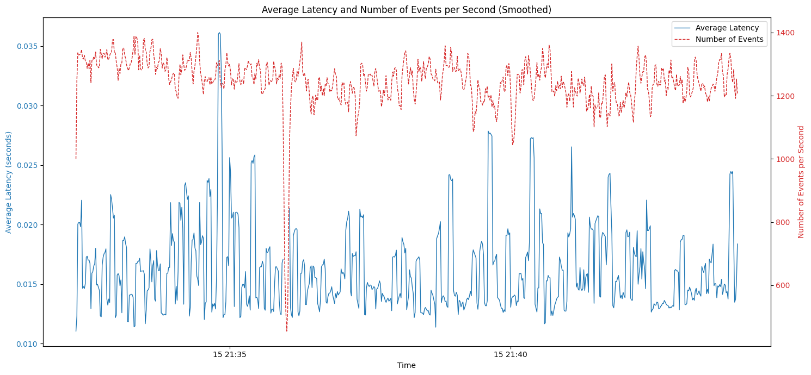

## Preface

- This post talks about solutions available in mongodb and mongo atlas to keep track of database changes.
- This was required in our case to sync external elastic search instance in sync with changes going on in multiple collections of mongodb.
- Wrong choices of config which is setup default will result in terrible performance, might even repeling users from using this architecture.

## Problem

- A feature came up that required fast retrieval from millions of documents in a collection of mongo. We needed to filter a few hundred entries from millions of docs.
- We decided to go with elasticsearch for full text search across thousands of documents but the hurdle here was keeping the elastic in sync with changes in db done by information extraction.
- We had data manipulation happening in multiple stages of document processing, thus our backend had database operation all over the place.

## How the Hunt for a good solution started

- Initial Solutions:
  - Hook into database for event based insertion.
  - Change each part of backend that refrenced mongodb operation.
- A team member among us experimented much with triggers and its connection to private elastic deployment.
  - Could not make this work without letting traffic leak into the wide internet. Somehow atlas trigger did not let us connect using private ip of our elastic instance, it kept saying its a restricted host.
  - It also had other challenges like the ip of serverless instances that run this "trigger" was elusive to even get if we wanted to allow it in our firewall.
- After failure of this, it led us experiment with mongodb streams.
  - Mongodb had built in feature called streams to listen for the changes by clients through the same connection that enables its access.
  - It did this by advertising modified oplogs to the clients.
- The first experiment with streams was reported by the team to have very bad performance, the messages would get received very late, sometimes even after 3-4 mins.
  - My first thought was, this should not be this bad, a database advertising its oplog should not be this slow, thus I started digging in this.

## The Experiment

- I with the help my trustee friend gpt created the right env to test this claim. I was keen on learning golang, thus chose it for the job:
  - The first go would continuously send operation requests like update, create and delete while writing the current timestamp, operation along with doc_id in a local file.
  - The second one would listen for events through streams, writing the same details in another file.
  - Then these two files were tallied cronologically to find the latency of operation.
  - These were the initial results:
  ```
      count    2872423.000000


    mean         199.910508
    std          601.038466
    min            0.000000
    50%           34.986000
    90%          456.072600
    95%         1037.822600
    99%         2964.515180
    max        23052.747000

    All latencies in ms
  ```
  
  - Not bad numbers IMHO.
  - But I had been missing one critical thing in this experiment. The data in the change stream had ony the delta. i.e. just the actual oplog
  - I had already presented this as a good possible solution of the problem, that made my heart melt a little.
- After this setback in my shoulders already, doing a task which was not assigned to me at the first place, had me going a bit deeper into trying things to make this work.
- There was a option that you could pass to watch function of mongo client that is supposed to give us the updated document called `fullDocument:updateLookup`.
  - This gave me the results that my teammates were getting. The latencies shot up to 300-400 secs till the ops/sec died down in the primary node, after which all the pending oplogs would flood at once.
- This had me thinking, this is one of the basic requirement of a good database engine, why would mongodb be so bad at this.
- Then I changed the readpreference of the client to prefer secondary, it improved somewhat but was still not satisfied with the result.
- Digging down a little, mongodb had a feature called `changeStreamPreAndPostImages` as a property of a collection that stored the previous and later state of a document for each and every update till all the secondaries and the ones listening for changes were notified. There is also other setting to set the ttl for documents to be on this collection so that it does not flood the storage. [Mongo Docs](https://www.mongodb.com/docs/manual/reference/method/db.collection.watch/#change-streams-with-document-pre--and-post-images)
- After enabling this for the collection in question we got the numbers we were looking for. The latencies were almost equivalent to the first part but with the data we want.
  

## Conclusion

- Dig a little deeper if things seem too good to be true. This was a feature that every mainstream popular database should implement, but we did not research it throughly before coming into conclusion.
